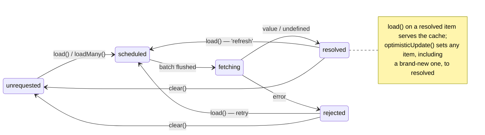

# BatchLoader

[](https://www.npmjs.com/package/@koderfunk/batch-loader)
[](https://github.com/KODerFunk/batch-loader/actions/workflows/main.yml)
[](https://opensource.org/licenses/MIT)
[](https://nodejs.org)

A TypeScript batch loader that collects individual requests into batches and caches the results —
with [**observable per-item state**](#observing-item-state),
[**optimistic updates**](#optimistic-updates),
[**cache invalidation**](#cache-invalidation),
[**early flush**](#early-flush), [**max batch size**](#how-batching-works)
and [**pluggable stores**](#custom-items-store).

Think [`dataloader`](https://github.com/graphql/dataloader), but designed so that your UI (or any
other consumer) can synchronously ask *"what is the status of this item right now?"* —
`scheduled`, `fetching`, `resolved` or `rejected` — without awaiting anything.

```ts
import BatchLoader from '@koderfunk/batch-loader'

type User = { id: string, name: string }

const userLoader = new BatchLoader<string, User>({
  batchFetch: async (ids) => {
    const response = await fetch(`/api/users?ids=${ids.join(',')}`)
    const users = await response.json() as User[]
    return ids.map((id) => users.find((user) => user.id === id))
  },
})

// Somewhere in component A…
const alice = await userLoader.load('alice')

// …and somewhere else in the very same tick, in component B:
const bob = await userLoader.load('bob')

// Only ONE request was sent: GET /api/users?ids=alice,bob
```

## Table of contents

- [Installation](#installation)
- [Alternatives](#alternatives)
- [How batching works](#how-batching-works)
- [Observing item state](#observing-item-state)
- [API](#api)
- [Error handling](#error-handling)
- [Early flush](#early-flush)
- [Cache invalidation](#cache-invalidation)
- [Optimistic updates](#optimistic-updates)
- [Custom items store](#custom-items-store)
- [Requirements](#requirements)
- [Development](#development)
- [Changelog](#changelog)
- [License](#license)

## Installation

```shell
npm install @koderfunk/batch-loader
```

or

```shell
yarn add @koderfunk/batch-loader
```

or

```shell
pnpm add @koderfunk/batch-loader
```

The package ships both ESM and CommonJS builds behind an `exports` manifest:

```js
import { BatchLoader } from '@koderfunk/batch-loader' // ESM
const { BatchLoader } = require('@koderfunk/batch-loader') // CommonJS
```

## Alternatives

The closest direct alternatives, compared fact by fact:

| Capability | [`@koderfunk/batch-loader`](https://www.npmjs.com/package/@koderfunk/batch-loader) | [`dataloader`](https://github.com/graphql/dataloader) | [`@yornaath/batshit`](https://github.com/yornaath/batshit) | [`promise-batcher`](https://github.com/WesVanVugt/promise-batcher) |
|---|---|---|---|---|
| Merges concurrent loads into one request | ✅ | ✅ | ✅ | ✅ |
| Request deduplication | ✅ | ✅ | ✅ | ❌ |
| Custom scheduling window | ✅ `batchScheduleFn` | ✅ `batchScheduleFn` | ✅ `scheduler` | ✅ `queuingDelay` / `delayFunction` |
| Early flush of a pending batch | ✅ `flush()` | ❌¹ | ✅ `next()` | ✅ `send()`² |
| Batch aborting (`AbortSignal`) | ❌ | ❌ | ✅ `abort()` | ❌ |
| Max batch size | ✅ `maxBatchSize` | ✅ | ✅ `windowedFiniteBatchScheduler` / `maxBatchSizeScheduler` | ✅ `maxBatchSize` |
| Result cache | ✅ long-lived | ✅ instance-scoped (per-request by convention) | ❌ (delegated, e.g. to react-query) | ❌ |
| Cache invalidation | ✅ `clear` / `clearAll` | ✅ `clear` / `clearAll` | ❌ | ❌ |
| Synchronous item status and cached result | ✅ `getStatus` / `getState` / `getResult` | ❌ | ❌ | ❌ |
| Optimistic updates | ✅ `optimisticUpdate` | ❌ | ❌ | ❌ |
| Per-item errors inside one batch | ✅ (`R \| Error \| undefined`) | ✅ (`Error` at index) | ❌ | ✅ (`Error` at index, + retry token) |
| Per-item auto-retry | ❌ | ❌ | ❌ | ✅ `BATCHER_RETRY_TOKEN` |
| Pluggable (incl. immutable / Redux-like) stores | ✅ | ➖ `cacheMap` (promise cache only) | ❌ | ❌ |
| Refetch strategy control | ✅ (`'unfetched' \| 'refresh'`) | ❌ | ❌ | ❌ |
| Idle tracking | ❌ | ❌ | ❌ | ✅ `idling` / `idlePromise()` |

¹ `dataloader`'s `batchScheduleFn` receives the dispatch callback, so *manual dispatch* is possible
by capturing it — but there is no first-class early-flush method.
² `promise-batcher`'s `send()` bypasses only `queuingDelay` and still respects `maxBatchSize`.

Other semantic nuances worth knowing:

- `dataloader` caches per-item errors (a repeated `load` rejects with the same error), while a
  whole-batch failure clears the affected keys; `@koderfunk/batch-loader` always re-fetches
  `rejected` items on the next `load`.
- `dataloader`'s `loadMany` resolves with `Error` instances in place of failed items; ours rejects
  as soon as any item rejects.
- our `optimisticUpdate` is revision-protected: a batch started before it cannot overwrite the
  optimistic value (neither the store nor the issued `load()` promise); `batshit` relies on
  react-query optimistic updates (`cancelQueries` + rollback) for this, while `dataloader`'s
  `prime()` cannot replace an already issued `load()` promise.
- `batshit` also ships a debounce scheduler (`bufferScheduler`) and React devtools. Our single
  `batchScheduleFn` invocation per batch cannot express debouncing natively — see the roadmap note
  in [Development](#development).

When to choose what:

- [**`@koderfunk/batch-loader`**](https://www.npmjs.com/package/@koderfunk/batch-loader) — when the loader itself 
  must double as a long-lived, observable, optimistic cache — with invalidation (`clear`/`clearAll`)
  and early flush (`flush()`) — or when its state should live in your own store.
- [**`dataloader`**](https://github.com/graphql/dataloader) — the battle-tested 
  default for request-scoped server flows (GraphQL resolvers, N+1 fixes). 
  The cache lives and dies with the request, and there is no observable state: 
  `load()` gives you a promise, nothing more.
- [**`@yornaath/batshit`**](https://github.com/yornaath/batshit) — a resolver-based batcher 
  designed to pair with react-query, which owns caching and observability.  
  Arbitrary query objects, early flush (`next()`), batch aborting (`abort()`), max-batch-size and
  debounce schedulers, devtools.
- [**`promise-batcher`**](https://github.com/WesVanVugt/promise-batcher) — a bare batching primitive: 
  time/size/threshold triggers, per-item errors and retry tokens, idle tracking,
  no cache or state layer of its own.

## How batching works

1. `load(id)` / `loadMany(ids)` mark requested ids as `scheduled` and push them into a buffer.
2. The buffer is flushed by a scheduling callback (`batchScheduleFn`, `setTimeout(callback)` by
   default): every id accumulated within the same tick (or custom window) goes into **one**
   `batchFetch` call. With `maxBatchSize` set, a bigger buffer is split into parallel chunks of at
   most that many ids — each chunk gets its own `batchFetch` call.
3. Repeated `load` of a pending or resolved id returns the **same promise** — no duplicate requests.
4. Once `batchFetch` resolves, results are applied item by item, and each item moves to
   `resolved` (or `rejected`) — and everyone awaiting gets their value.

```ts
const loader = new BatchLoader<string, User>({
  // Collect ids within a longer window (e.g. 10ms) before fetching:
  batchScheduleFn: (callback) => { setTimeout(callback, 10) },
  // No more than 50 ids per single request:
  maxBatchSize: 50,
  batchFetch,
})
```

Retries are opt-in by nature: a `rejected` item is re-fetched by the next `load()` call, while a
`resolved` one is served from cache — unless `refetchStrategy: 'refresh'` is enabled.

## Observing item state

This is the core differentiator. Every item has a synchronous, observable status:

```ts
loader.load(userId)

const state = loader.getState(userId)
// → { status: 'fetching', result: undefined }

const cached = loader.getResult(userId)
// → User | undefined — instantly, for already resolved items
```

A typical React-ish usage (works with any view/state layer):

```ts
function renderUser(id: string) {
  switch (userLoader.getStatus(id)) {
    case 'unrequested':
    case 'scheduled':
    case 'fetching':
      return `<skeleton for ${id}>`
    case 'resolved':
      return `<user ${userLoader.getResult(id)?.name}>`
    case 'rejected':
      return `<error for ${id}: ${String(userLoader.getState(id).error)}>`
  }
}
```

## API

### `new BatchLoader<ID extends number | string, R>(options)`

#### Options

| Option | Type | Default | Description |
|---|---|---|---|
| `batchFetch` | `(ids: ID[]) => Promise<(R \| Error \| undefined)[]>` | — *(required)* | Fetch many items at once. The result array must match the order and length of `ids`: a value resolves the item, an `Error` rejects it, `undefined` resolves it with `undefined` (e.g. "not found"). |
| `batchScheduleFn` | `(callback: () => void) => void` | `setTimeout(callback)` | Controls how the batch window is scheduled. Use a custom scheduler (microtask, `requestIdleCallback`, …) to change how aggressively requests are grouped. |
| `maxBatchSize` | `number` | — | Max ids per one `batchFetch` call. A bigger buffer is flushed in **parallel chunks** of at most this many ids. Must be a positive integer. |
| `itemsStore` | `IBatchLoaderItemsStore<ID, R>` | `DefaultBatchLoaderItemsStore` | Storage for item states. See [Custom items store](#custom-items-store). |
| `refetchStrategy` | `'unfetched' \| 'refresh'` | `'unfetched'` | `'unfetched'`: `load` serves `resolved` items from cache. `'refresh'`: `load` re-fetches `resolved` items. `rejected` items are always re-fetched. |
| `onError` | `(error: unknown) => void` | — | Called when the batch as a whole fails: `batchFetch` throws/rejects, resolves with a non-array or a wrong-length array, or the store rejects an update. Per-item errors do not trigger it. With `maxBatchSize`, chunks are independent — every failing chunk invokes `onError` once. |

Invalid options (non-function `batchFetch`/`batchScheduleFn`, non-positive-integer `maxBatchSize`)
and `load(null | undefined)` throw a `TypeError` immediately — bad usage is reported loudly
instead of hanging.

#### Methods

| Method | Returns | Description |
|---|---|---|
| `load(id: ID)` | `Promise<R>` | Request one item. Deduplicates: pending/known ids return the existing promise. |
| `loadMany(ids: readonly ID[])` | `Promise<R[]>` (tuple-preserving) | Request many items; one batch call for the unknown ones, results in input order. Rejects if any item rejects. |
| `getResult(id: ID)` | `R \| undefined` | Cached result, without touching the network. |
| `getStatus(id: ID)` | `BatchLoaderStatus` | `'unrequested' \| 'scheduled' \| 'fetching' \| 'resolved' \| 'rejected'`. |
| `getState(id: ID)` | `IBatchLoaderGetStateResult<R>` | `{ status, result }` (+ `error` for rejected items). |
| `optimisticUpdate(id: ID, result: R)` | `void` | See [Optimistic updates](#optimistic-updates). |
| `flush()` | `void` | Execute the currently scheduled batch immediately, ignoring the scheduling window. See [Early flush](#early-flush). |
| `clear(id: ID)` | `void` | Remove one item from the cache, so the next `load` re-fetches it. |
| `clearAll()` | `void` | Remove all items from the cache. |

#### Item statuses



- `scheduled` — requested, waiting in the batch window.
- `fetching` — inside an in-flight `batchFetch`.
- `resolved` — done; `getResult` returns the value (possibly `undefined`).
- `rejected` — failed; `getState().error` holds the reason. The next `load` retries it.

`clear()` on a pending (`scheduled`/`fetching`) item drops it together with its promise —
awaiting that particular promise will never settle (same as `dataloader`'s `clear`).

## Error handling

`batchFetch` communicates three kinds of outcomes:

```ts
const loader = new BatchLoader<string, User>({
  batchFetch: async (ids) => {
    const users = await db.users.findMany({ where: { id: { in: ids } } } )
    return ids.map((id) => {
      const user = users.find((candidate) => candidate.id === id)

      // per-item error — rejects only this item's promise:
      return user ?? new Error(`User ${id} not found`)
      // …or resolve with undefined for soft-misses:
      // return user
    })
  },
  onError: (error) => {
    // only for whole-batch failures
    reportToSentry(error)
  },
})
```

- **`Error` at index `i`** — item `ids[i]` becomes `rejected`, its promise rejects; other items
  of the batch resolve normally.
- **`undefined` at index `i`** — item becomes `resolved` with `result: undefined`.
- **`batchFetch` throws / rejects** — every buffered item becomes `rejected` with the thrown
  reason, and `onError` is invoked once.
- **`batchFetch` resolves with a non-array or an array whose length differs from `ids`** —
  treated as a whole-batch failure: every item is `rejected` with a descriptive `TypeError`
  and `onError` is invoked. (Results apply only to items that still exist — ones removed by
  `clear()` mid-flight are simply skipped.)

With `maxBatchSize`, chunks are independent: a failing chunk rejects only its own items,
the parallel chunks settle normally.

## Early flush

Don't wait for the scheduling window — dispatch the pending batch right now:

```ts
userLoader.load('alice')
userLoader.load('bob')

userLoader.flush()
// → batchFetch(['alice', 'bob']) fires immediately,
//   the original scheduler callback is ignored when it fires later
```

`flush()` respects `maxBatchSize` chunking and is a no-op when nothing is scheduled — including
while another batch is still in flight: ids loaded during a fetch are buffered and dispatched
only after it settles. The "manual dispatch" pattern also works: capture the callback inside a
custom `batchScheduleFn` and invoke it whenever you decide — exactly like `dataloader` users do.

## Cache invalidation

A long-lived cache needs invalidation. `clear`/`clearAll` remove items, so the next `load`
re-fetches them:

```ts
// After a mutation invalidated the user:
userLoader.clear(userId)
await userLoader.load(userId) // re-fetches

// After a global invalidation event:
userLoader.clearAll()
```

## Optimistic updates

Update an item locally without waiting for (or even initiating) a fetch — e.g. right after a
successful mutation:

```ts
async function renameUser(id: string, name: string) {
  await api.renameUser(id, name)

  // Instantly reflected in getState/getResult for every observer:
  userLoader.optimisticUpdate(id, { id, name })
}
```

If the item is unknown yet, `optimisticUpdate` creates it as already `resolved` — subsequent
`load(id)` calls will return this value without a request (until a `refresh` refetch). For a
known item, a previously issued promise is never left behind: it settles with the optimistic
value right away, and subsequent `load(id)` calls return the optimistic value too.

Optimistic values are protected against **stale in-flight batches**. When a batch is dispatched,
it snapshots a per-item optimistic revision, and each `optimisticUpdate` bumps it. A batch that
was already in flight when `optimisticUpdate` was called will not overwrite the optimistic value:
neither the store nor the already issued `load(id)` promise — that promise settles with the
optimistic value right away, even if the batch then fails. A batch started *after* the update
(e.g. a `refetchStrategy: 'refresh'` refetch) applies normally — that is the fresh server data.

## Custom items store

Item state lives behind a tiny `IBatchLoaderItemsStore` interface (`get`, `add`, `update`,
`batchUpdate`, plus optional `delete`/`clear` that enable `loader.clear()`/`loader.clearAll()`).
The default store is a `Map`-backed mutable implementation, but you can plug in an
**immutable** one backed by any external state container (Redux, Zustand, React state, …) so
that the loader's cache itself becomes observable through your store:

```ts
import { BatchLoader, ImmutableBatchLoaderItemsStore } from '@koderfunk/batch-loader'

const userLoader = new BatchLoader<string, User>({
  batchFetch,
  itemsStore: new ImmutableBatchLoaderItemsStore<string, User>(
    () => store.getState().usersById,           // read-through
    (nextState) => store.dispatch(usersLoaded(nextState)), // write-through
  ),
})
```

Every loader transition then flows through your store's normal update path — components can
subscribe to loading states with their usual selectors.

## Requirements

- Zero runtime dependencies; ES2022 output (`Map`, classes, spread — `Promise.withResolvers`
  is used natively with a built-in fallback for older runtimes).
- Node.js `>= 18` or any ES2022-capable JavaScript runtime. CI runs the test suite on
  Node 18–24 and smoke-tests the packed artifact in both module formats (lint and type-check
  run on 22/24 only, since the dev toolchain requires Node >= 22); the
  `Promise.withResolvers` fallback for older runtimes is covered by unit tests.
- TypeScript types are generated with TS 5.x.

> **Module format note.** The package ships dual ESM/CJS builds behind an `exports` manifest —
> native ESM (`.mjs`) via `import` and CommonJS (`.js`) via `require` both work out of the box
> in Node.js >= 18 and in bundlers (Vite, webpack, esbuild, Next.js, …).

## Development

```shell
npm install
npm test          # Jest + coverage
npm run lint      # ESLint (flat config) with --fix
npm run ts-check  # TypeScript, no emit
npm run build     # Clean dist/ + tsc + lint dist
npm run release   # Publish via np
```

Pull requests are welcome. Please keep 100% coverage and follow the existing strict ESLint setup
(`eslint.config.mjs`).

Roadmap ideas (not yet implemented): `abort()` with an `AbortSignal` for in-flight batches,
a per-item retry token, cache priming (`prime`), idle tracking, `cacheKeyFn` for arbitrary
object keys (as in `dataloader`), a richer scheduler contract like batshit's
`(start, latest, batchSize)` for native debounce/size-triggered flushing.

## Changelog

See [CHANGELOG.md](CHANGELOG.md).

## License

[MIT](LICENSE)
